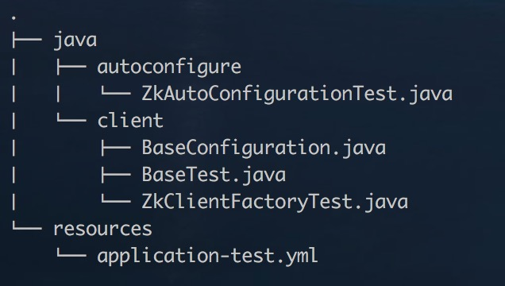

### starter-zookeeper

#### 1. 关于starter-zookeeper
* 自动装配配置信息；
* 基于ZK封装了分布式环境下的发布/订阅模式；
* 使用JDK 8的Lambda表达式: 函数式编程, 接口编程.

#### 二. 项目结构

* 源码


```
ZookeeperProperties.java: 装配属性配置信息;
ZookeeperAutoConfiguration.java: 提供ZookeeperClientFactory的Bean;
ZookeeperClientFactory.java: 客户端工厂类;
Publisher.java: 发布者;
Subscriber.java: 订阅者;
```
* 测试代码



```
ZkAutoConfigurationTest.java: 测试配置的自动加载与Bean装配;
ZkClientFactoryTest.java: 发布/订阅测试用例;
```

#### 三. 配置(application.yml)
##### 使用Spring-Boot的yml文件进行配置的管理.
```
zookeeper:
  host: 127.0.0.1
  port: 2181
```

### 四. 如何使用
* 1 引入依赖

```
    <groupId>star.xiaolei</groupId>
    <artifactId>starter-zookeeper</artifactId>
    <version>1.0-SNAPSHOT</version>
```

* 2 自动装配

```
    @Autowired
    private ZookeeperClientFactory zookeeperClientFactory;

    @Test
    public void test() throws Exception {
        String topic = "/test";

        Publisher publisher = new Publisher(zookeeperClientFactory, topic);

        Subscriber subscriber = new Subscriber(zookeeperClientFactory, topic);

        subscriber.subscribe(data -> System.out.println(Arrays.toString(data)));

        publisher.publish("test".getBytes());
    }
```

### 五. 待续
* 支持Cluster模式配置发现与装载.